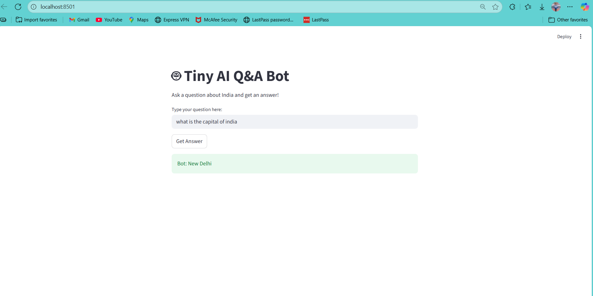

# Tiny AI-Powered Q&A Bot

This is a simple AI-powered app built for the intern assignment.  
It answers questions about India using Hugging Face's Q&A model and uses TextBlob for silent spell correction.  
It features both a command-line and Streamlit web UI.

---

## Features

- **Q&A bot:** Answers questions using Hugging Face's `deepset/roberta-base-squad2` model.
- **Spell correction:** Automatically corrects user spelling with TextBlob.
- **Secure API key:** Uses `.env` and `python-dotenv` for secret management (never hardcodes keys).
- **Web UI:** Simple and interactive interface built with Streamlit.

---

## Setup

### 1. Clone the repository

```bash
git clone https://github.com/<21112Vivek>/tiny-ai-app.git
cd tiny-ai-app
```

### 2. Create a `.env` file

**Do NOT share or commit this file!**

```
HF_API_KEY=your_huggingface_api_key_here
```

### 3. Install dependencies

```bash
pip install -r requirements.txt
python -m textblob.download_corpora
```

### 4. Run the command-line app

```bash
python app.py
```

### 5. Run the Streamlit web app

```bash
streamlit run streamlit_app.py
```

---

## Security

- `.env` is **listed in `.gitignore`** and never pushed to GitHub.
- Each user must create their own `.env` with their personal Hugging Face API key.

---

## Documentation

See `setup_log.md` for a record of setup steps, troubleshooting, and learning journey.

---

## Stretch Goals

- [x] Added Streamlit web UI
- [ ] Deploy to Hugging Face Spaces or Render
- [ ] Add more context and features

---

## Troubleshooting

- If you get an error about TextBlob corpora, run:
  ```
  python -m textblob.download_corpora
  ```
- If you get an API error, check your `.env` file and Hugging Face account limits.

---

## Screenshots

### Streamlit Web App



## Contact


For questions or feedback, open an issue or contact me via GitHub.
## My journey
## How I Started
I began this project with a simple goal: build an AI-powered app that could answer questions intelligently. I chose Python as my language and explored Hugging Face’s models for question answering. I wanted the app to feel helpful and intuitive, so I added automatic spelling correction using TextBlob to improve user input.
I started with a command-line version to understand the core logic and API integration. Once that was working, I challenged myself to build a web interface using Streamlit — something I had never used before. I also learned how to manage API keys securely using .env files and python-dotenv.

## Challenges I Faced
Got a 403 error from Hugging Face — solved it by correctly setting the API key in .env
Initially tried GPT-style models, but they didn’t support question answering well — switched to roberta-base-squad2
Faced issues with Streamlit buttons not triggering — learned how Streamlit handles state
Learned that context size matters — too much text can confuse the model or slow down responses


